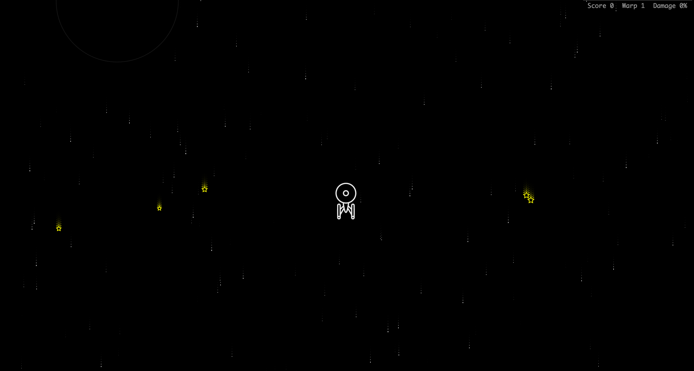

## **Starship enterprise 2017**

_Inspired by starship [`NCC-1701-A`](https://en.wikipedia.org/wiki/USS_Enterprise_(NCC-1701-A))_ 

### Preview:
[DEMO](https://starship-enterprise.vercel.app/)

### Rules:

- collect stars to get more warp speed 
- avoid hard-to-see black holes (hey, they are caled black for reason) to prevent ship damage
- stars have higher value on higher warp level
- more starrs = more speed
- use brake = loose speed
### Controls:

- desktop browser
    - move
        - up arrow
        - down arrow
        - left arrow
        - right arrow     
    - brake
        - space (you will lose all warp levels, it also lock speed)   

- mobile browser
    - move
        - tilt screen
    - brake
        - touch screen (loose one warp level)
  

### Installation:

`Install: yarn install`

`Start: yarn start`
